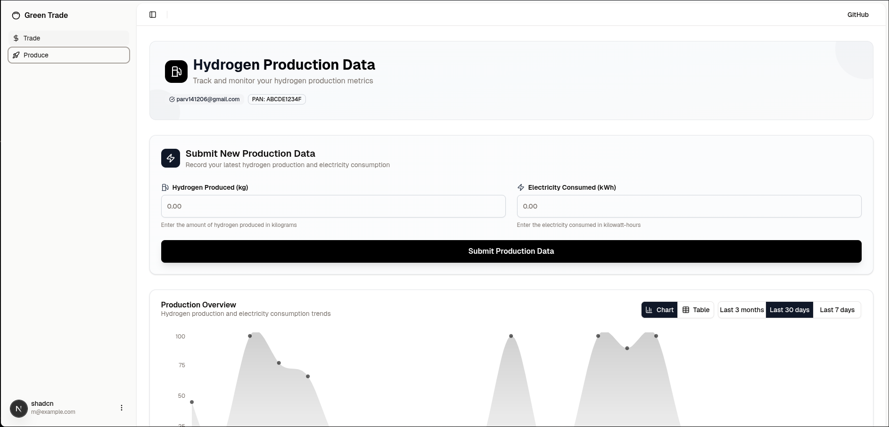
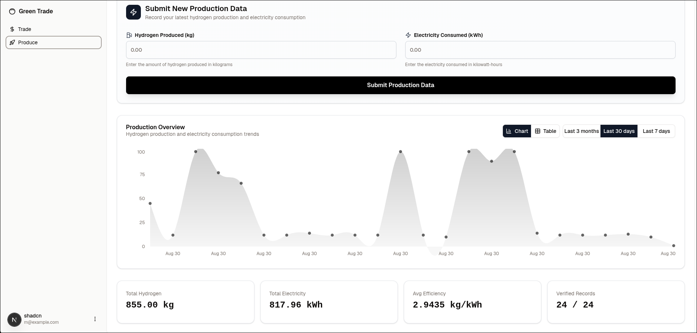

---

## 📖 Overview

This project implements a **blockchain-based distributed ledger** for **Green Hydrogen Fuel Registry**.
It allows producers and consumers to securely store and trade transactions on-chain with features like:

- ✅ Immutable transaction history
- ✅ Tokenized credit system
- ✅ Smart contract-based trading
- ✅ Wallet-based identity management

---

## 🎬 Demo Video

## Note, all values are coming live from blockchain!

<div align="center">
  <video width="80%" controls>
    <source src="docs/demo.mp4" type="video/mp4">
    Your browser does not support the video tag.
  </video>
</div>

### Screenshots




## 🛠️ Tech Stack

```
Solidity – Smart contract development
Hardhat – Ethereum development environment
Next.js – Backend integration
PostgreSQL – Off-chain storage
Ethers.js – Blockchain interaction
Ganache – Local testnet or public testnet
```

---

## 📂 Project Structure

```
/project-root
 ├── contracts/        # Solidity containing smart contracts
 ├── scripts/          # Deployment & interaction scripts
 ├── src/              # Main Source code of the Project
 ├── test/             # Unit & integration tests
 ├── hardhat.config.js # Hardhat configuration
 ├── package.json
 └── README.md
```

---

## ⚠️ Notes

- Replace the dummy `parv141206` with your **Gmail account** for OTP login.
- Currently, **dummy data** is used since government organizations take \~7–8 days to approve access to official APIs.

**File Modifications Required:**

- `src/app/login/page.tsx` → Replace `parv141206` with your Gmail.
- `src/server/auth/config.ts` → Replace `parv141206` with your Gmail.

---

## ✅ Implemented Features

1. **Production Monitoring & Proposing** – Tracks green hydrogen production data.
2. **Data Verification** – Ensures accuracy of fuel generation records.
3. **Tokenisation** – Converts verified production into blockchain tokens.
4. **Marketplace Trading** – Real-time peer-to-peer trading of credits.
5. **Token Burning** – Used tokens are permanently removed from circulation.
6. **Continuous Transaction Logs** – Transparent and immutable tracking.

---

## 🔐 Specifications & Special Features

```
- OTP-based Login – Secure access using Gmail OTP authentication.
- PAN Card & GST Verification – Identity validation for producers.
- Solution to Double Spending – Ensures token uniqueness & prevents replay attacks.
- Distributed Ledger Technology – Decentralized and fault-tolerant storage.
- Live Data Graphs – Real-time dashboard for credit & transaction monitoring.
- Secure Wallet Transmission – Encrypted wallet-to-wallet transfers.
```

---

## 📌 Usage

1. **Register a Producer** → PAN/GST verification & wallet creation.
2. **Add Credits** → Producers mint credits representing hydrogen production.
3. **Trade Credits** → Secure marketplace for real-time transactions.
4. **Burn Tokens** → Credits are consumed & permanently removed once used.
5. **View Ledger** → Access full immutable transaction history.

---

## ⚡ Setting Up the Project

### 1. Clone the Repository

```bash
git clone https://github.com/parv141206/greentrade
cd greentrade
```

### 2. Install Dependencies

```bash
npm install
```

### 3. Compile Smart Contracts

```bash
npx hardhat compile
```

### 4. Deploy Smart Contracts

```bash
ts-node scripts/deploy.ts
```

### 5. Run the app

```bash
pnpm run dev
or
npm run dev
```
